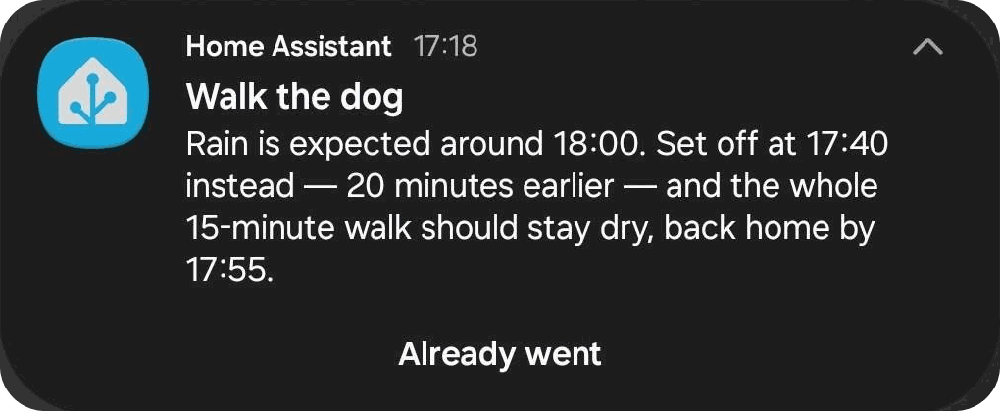
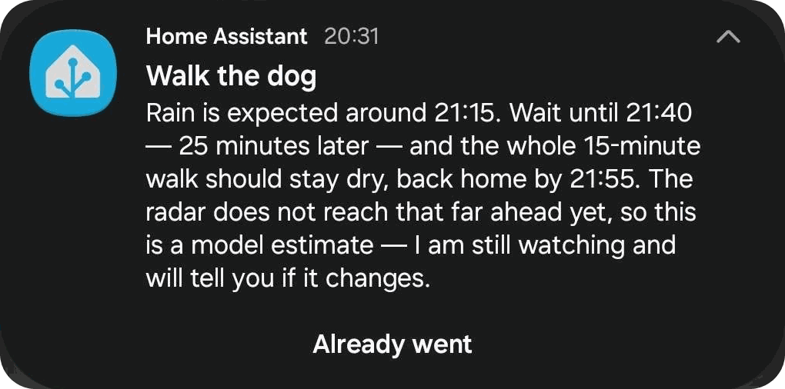

# Walk the dog 🐕🌧️

*Polish: „Idź już z psem"*

A [Home Assistant](https://www.home-assistant.io/) custom integration that predicts whether it
will rain during your recurring dog walks — and, when a walk is at risk, proactively suggests
going out **earlier or later** so the walk stays dry.

Instead of trusting a single weather app, it combines ready-made precipitation nowcasts from
multiple independent sources covering Poland, scores how much they agree, and only alerts you
when the consensus says your walk window is wet.

## What it looks like

Two real alerts, three hours apart. The first moves the walk forward; the second holds it
back — and says plainly that the radar cannot see that far yet, so the time may still change.

## Features

- **Consensus, not a guess** — a radar nowcast (EUMETNET OPERA via LibreWXR) plus two
  independent NWP models (DWD ICON-EU and KNMI HARMONIE AROME via Open-Meteo), with MET Norway
  as automatic failover. Sources are weighted by reliability and freshness; the sensor reports
  a confidence value and a per-source breakdown.
- **A second radar where it is available** — around south-western Poland (Bielsko-Biała, the
  Silesian foothills, the Czech border) the Czech CHMI CZRAD nowcast joins in as an extra vote,
  on its own 1 km grid. It covers only its own region, so everywhere else it stays silent and
  costs nothing — no setting to turn on, and nothing changes if you live outside it.
- **Actionable advice** — "go 20 minutes earlier" or "wait half an hour", searched on a
  10-minute grid within your configured margins; not just "rain expected".
- **One notification at the right moment** — pushed at the last actionable time
  (`walk − earlier margin`), re-sent only when the recommendation materially changes, and
  **never about a time that has already passed**. Optional auto-mute while you are away from
  home, and an optional `walk_the_dog_alert` event for your own automations.
- **It keeps watching, and says when it is not sure yet** — the radars see one hour ahead and the
  hourly models see the day, so "wait until 14:00" decided at 12:00 is marked as an estimate and
  re-checked as 14:00 comes into radar range. You are told again only if the answer changes. In
  the last twenty minutes before you set off it looks twice as often, where a radar publishes
  fast enough for that to mean anything.
- **One button: *Already went*** — closes that walk, on every phone it was sent to, and stops
  the requests with it. Optionally, a short "still on" (or "the rain has gone, walk as normal")
  a few minutes before you actually leave.
- **Kind to small hardware** — polls only around your walk times (zero requests otherwise),
  samples only the pixels around your location, and stays within strict memory and request
  budgets. Runs comfortably on single-core ARM boxes.

## Requirements

- Home Assistant 2026.8 or newer.
- A location in Poland (the selected data sources cover Poland; most also cover wider Europe,
  but coverage is only verified for Poland).
- A mobile app notification target (`notify.mobile_app_*`) if you want push notifications.

## Installation

### HACS (recommended)

1. In HACS, search for **Walk the dog** and download it. If it is not in the store yet, add
   `https://github.com/zyndata/walk-the-dog` as a custom repository (category: *Integration*)
   first: **⋮ → Custom repositories**.
2. Restart Home Assistant.
3. **Settings → Devices & services → Add integration**, search for **Walk the dog**, and go
   through the wizard.

### Manual

1. Download the [latest release](https://github.com/zyndata/walk-the-dog/releases/latest).
2. Copy `custom_components/walk_the_dog/` into the `custom_components/` folder of your Home
   Assistant configuration directory, creating it if it does not exist.
3. Restart Home Assistant, then add the integration as in step 3 above.

Working on the integration itself is a different exercise — see
[docs/DEVELOPMENT.md](docs/DEVELOPMENT.md).

## Configuration

Everything is configured from the UI; nothing goes in `configuration.yaml`. The wizard asks
three things, and the options flow lets you change any of them later.

1. **Where you walk** — the home location and the alert radius, the disc around it that a
   forecast has to be dry over. Pre-filled from Home Assistant's own location.
2. **When you walk** — one of three schedule modes: the same times every day, a
   weekday/weekend split, or a full per-day schedule; plus how long a walk takes.
3. **How you want to be told** — which phone to notify, how far ahead of a walk an alert may
   arrive, how much earlier or later the integration may suggest going, and optionally a
   person or device tracker whose absence mutes the alert.

What it creates: a **recommendation sensor** for the next walk (risk, confidence, suggested
time, per-source breakdown), a **binary sensor** that is on while a walk window is being
watched, and a **switch** that turns alerting off entirely. Notifications carry an *Already
went* button, and a `walk_the_dog_alert` event fires alongside them for your own automations.

See [docs/CONFIG.md](docs/CONFIG.md) for every option and its semantics, including
[what it costs to run](docs/CONFIG.md#what-it-costs-to-run) in requests and megabytes.

## How it works

See [docs/ARCHITECTURE.md](docs/ARCHITECTURE.md) for the full design and
[docs/DATA_SOURCES.md](docs/DATA_SOURCES.md) for the source research. In short: within a
window around each scheduled walk, the integration samples each source's precipitation
forecast over a disc around your location, normalizes everything to a common mm/h scale,
computes a weighted-vote risk and confidence per 10-minute slot, evaluates your walk window,
and searches for the nearest dry window of the full walk duration.

## Maturity

`1.0.0` is feature-complete: everything described above is built, tested and measured. What it
is **not** is field-proven — the forecasts have been checked against recorded data, not against
a season of actual weather, and nobody has yet counted how often the advice was right. If it
tells you to wait and the rain never comes, that is worth an
[issue](https://github.com/zyndata/walk-the-dog/issues); tuning the consensus needs real
misses to tune against.

Home Assistant shows a placeholder icon for the integration in the **HACS store listing** only
— HACS does not yet read the brand images an integration ships with itself
([hacs/integration#5171](https://github.com/hacs/integration/issues/5171)). Everywhere inside
Home Assistant the real icon appears.

## Data sources & attribution

Weather data, modified (resampled and reclassified) by this integration:

- **LibreWXR** ([librewxr.net](https://librewxr.net/)) — weather data via LibreWXR, radar
  composite © [EUMETNET OPERA](https://www.eumetnet.eu/observations/weather-radar-network/)
  members, licensed [CC-BY-4.0](https://creativecommons.org/licenses/by/4.0/).
- **Open-Meteo** ([open-meteo.com](https://open-meteo.com/)) — forecast data by Open-Meteo,
  based on DWD ICON-EU and KNMI HARMONIE AROME model output, licensed
  [CC-BY-4.0](https://creativecommons.org/licenses/by/4.0/).
- **MET Norway** ([api.met.no](https://api.met.no/)) — weather data from the Norwegian
  Meteorological Institute, licensed
  [CC-BY-4.0](https://creativecommons.org/licenses/by/4.0/) /
  [NLOD](https://data.norge.no/nlod/en/2.0).
- **CHMI** ([opendata.chmi.cz](https://opendata.chmi.cz/)) — CZRAD radar composite and its
  extrapolation nowcast from the Czech Hydrometeorological Institute, licensed
  [CC-BY-4.0](https://creativecommons.org/licenses/by/4.0/). Used only for locations inside the
  Czech composite, which covers south-western Poland but not the rest of the country.

## Development

See [docs/DEVELOPMENT.md](docs/DEVELOPMENT.md). One command sets up the environment on
Windows or Linux: `python scripts/setup.py`.

## License

[MIT](LICENSE)
